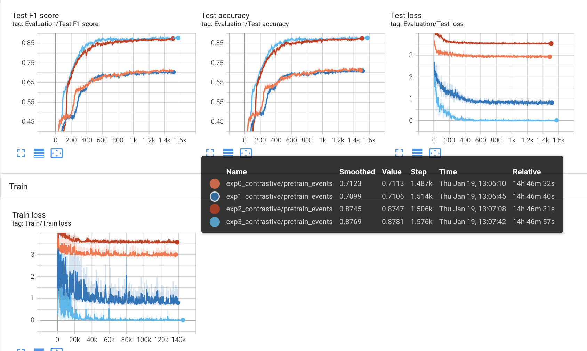
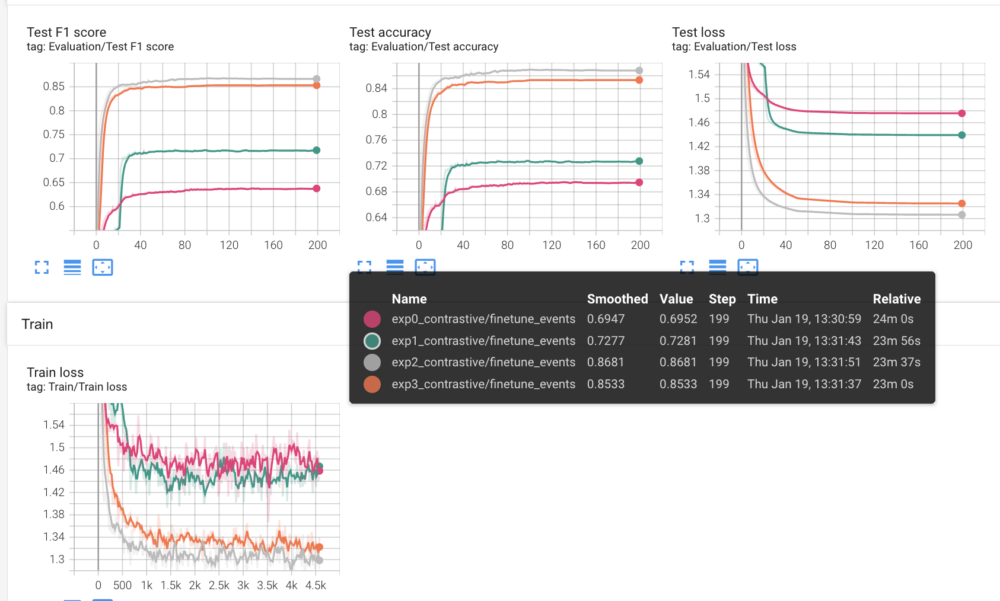
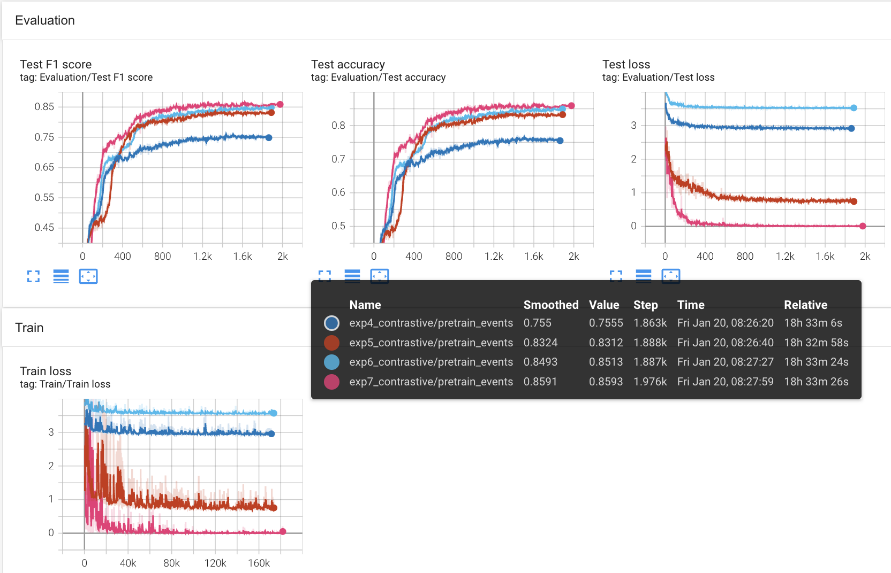
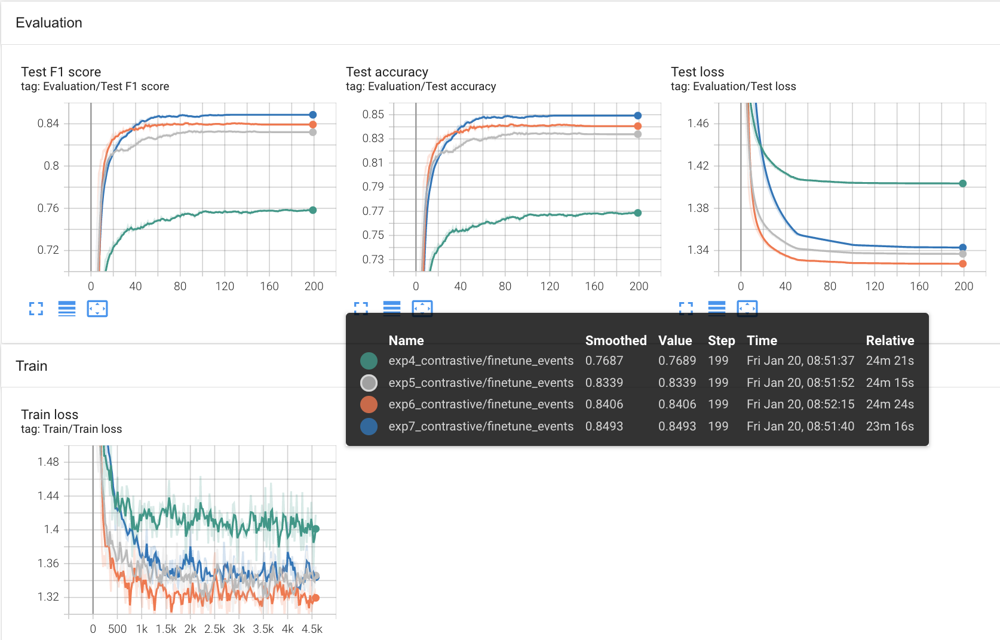
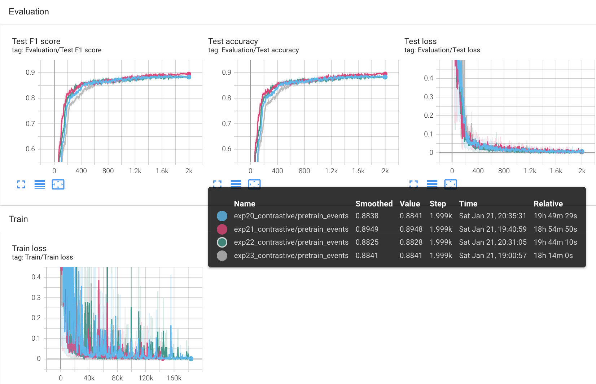
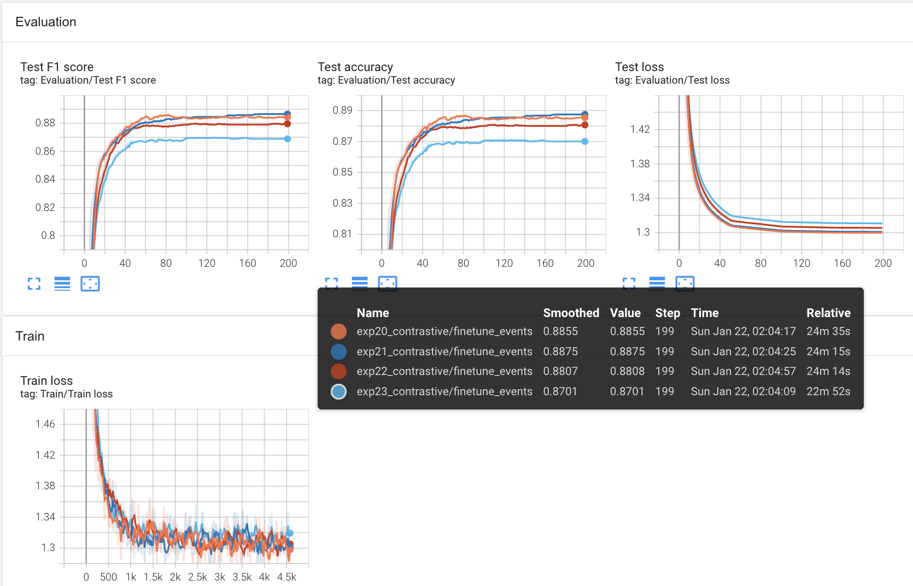

# Weekly Progress

Tommy Kimura (tkimura4@illinois.edu)

## Table of Contents  
[02/06/2023 - Contrastive Multiviews Coding](#February-6th-2023)
[01/22/2023 - Tune loss temperature](#january-22nd-2023)
[01/09/2023 - Added Mixup](#january-9th-2023)
[01/05/2023 - Added Drop Path Rate and Absolute Positional Embedding](#january-5th-2023)
[01/03/2023 - Added Padding and Flexible Image size](#january-3rd-2023)  
[12/27/2022 - Initialized TransformerV4](#december-27th-2022) 

## February-6th-2023

### Major changes
```bash
├── data
│   └── Parkland.yaml # SimCLR temperature parameters
├── src
│   ├── input_utils
│       └── multi_modal_dataset.py # Add index as another return value for NCE Average computation
│   └── models
│       ├── CMCModules.py # Add CMC wrapper class
│       ├── loss.py # Add CMC loss class and helper functions, NCEAverage, NCECriterion, NCESoftMaxLoss, all taken from CMC paper code
│       └── TransformerV4.py # added CMC modality, if set, only extract feature for that specific modality
│   ├── train_utils
│       ├── eval_functions.py # Add CMC framework support, (only one fixed augementation and multi_view features concatnation)
|       ├── knn.py # add CMC framework support
│       └── contrastive_train.py # Add CMC framework support, (only one fixed augmentation)
```

### Notes

- Potential issues and causes
    -  Loss functions
        - Maybe messed up the loss functions
    - TransformerV4
        - Incorrectly set up feature extractions for specific modality
- Only started on two views first. Wanted to first complete two views and then work on general multiple views. 

## January 22nd 2023

### Major changes
```bash
├── data
│   └── Parkland.yaml # SimCLR temperature parameters
```

### Experiements

#### Tuning SimCLR Temperature parameters

- Tuning Temperature parameters. Exp0 (temperature == 0.5) was previously used.
- Batch size is 64

| Name | Temperature | KNN Accuracy | Finetune Accuracy |
| -- | -- | -- | -- |
| exp0 | 0.5 | 71.13% | 69.47% |
| exp1 | 0.2 | 71.06% | 72.77% |
| exp2 | 0.75 | 87.47% | 86.81% |
| exp3 | 0.07 | 87.81% | 85.33% |

##### Accuracy Curves

###### KNN



###### Finetune




#### Using Cosine Scheduler

- Testing cosine scheduler with the same temperature setup as the previous experiment

| Name | Temperature | KNN Accuracy | Finetune Accuracy |
| -- | -- | -- | -- |
| exp4 | 0.5 | 75.55% | 76.89% |
| exp5 | 0.2 | 83.12% | 83.39% |
| exp6 | 0.75 | 85.13% | 84.06% |
| exp7 | 0.07 | 85.93% | 84.93% |

##### Accuracy Curves

###### KNN



###### Finetune




#### Change Optimizer

- Tried LARS and SGD, both did not converge.

#### Test even smaller temperature & larger batch size

- Temperature: 0.07 and 0.03
- Batch size: 64 and 82
- Scheduler: cosine scheduler

| Name | Temperature | Batch size | KNN Accuracy | Finetune Accuracy |
| -- | -- | -- | -- | -- |
| exp20 | 0.07 | 64 | 88.41% | 88.55% |
| exp21 | 0.07 | 82 | 89.48% | 88.75% |
| exp23 | 0.03 | 82 | 88.28% | 88.08% |
| exp22 | 0.03 | 64 | 88.41% | 87.01% |

##### Accuracy Curves

###### KNN



###### Finetune



## January 9th 2023

### Major changes

```bash
src
├── data
│   └── Parkland.yaml # changed a few parameters
├── src
│   ├── input_utils
│       └── mixup_utils.py
│   └── models
│       └── TransformerV4.py # added paddings
│   ├── train_utils
│       └── supervised_train.py
```

- Added mixup
- Naive version in branch `tkimura4_010722` and has achieved 90 accuracy (from paper github)s.
- Integrated timm's package with different modalities in `mixup_utils.py`
    - Timm's implementation uses reversed batch to compute mixup or cutmix which is not as regularized as naive version (in my opinion)
        - achieves lower accuracy
    - Added naive version into `mixup_utils.py` with a few changes, called `random_batch`
        - instead of computing `label_1` and `label_2` and compute loss `loss = loss_func(logits, labels_a) * lam + loss_func(logits, labels_b) * (1. - lam)`, compute loss as `loss = loss_func(logits, labels_a * lam + labels_b * (1 - lam))`
        - should results in the save loss value (tested on a few iterations)
    - But does not achieve the same accuracy as the naive version. Naive version achieves `90%` accuracy with 100% cutmix and 0% mixup. But the Timm random batch version only achieves `88%`.
    - Best Timm random batch version accuracy is around `89% - 90%` with `25%` mixup and `75%` cutmix

## January 5th 2023

### Major changes

```bash
src
├── data
│   └── Parkland.yaml # changed a few parameters
├── src
│   └── models
│       └── TransformerV4.py # added paddings
```

- `TransformerV4`
    - Added Drop path rate to `BasicLayer` initialization
    - Added optional Absolute Positional Embedding in `init` and `forward`
- `Parkland.yaml`
    - Audio window size `[5, 5]` -> `[5, 2]`
    - Seismic patch size `[1, 1]` -> `[1, 2]`


## January 3rd 2023

### Major changes

```bash
src
├── data
│   └── Parkland.yaml # changed a few parameters
├── src
│   └── models
│       ├── SwinModules.py # added flexible image size
│       └── TransformerV4.py # added paddings
```

### Flexible window size in `SwinModules.py`

`window_partition` & `window_reverse`

- Changed integer window size to integer list

`SwinTransformerBlock`

- Changed integer `window_size` to integer list
- Changed integer `shift_size` to integer list
    - Modified window size condition in `__init__()` for both direction
    - Since we are modifying the window size, the window size has to be a list rather than a tuple
- Changed all window_size & shift_size related to both horizontal and vertical parts

`BasicLayer`

- Changed integer `window_size` to integer list

### Paddings

`PadImages`

- Calculates the padded images

`TransformerV4 init`

- Changed PatchEmbed input from `image_size` to `padded_img_size`

`TransformerV4 forward`

- First calculate padding we need to reach `padded_img_size`
    - `padded_img_size - img_size`
- Test 1 (Pad to the front and back)
    - For width and height, divide paddings by half, and add one to prev or next if padding is odd
    - `F.pad(input=freq_input, pad=(padded_width_prev, padded_width_next, padded_height_prev, padded_height_next), mode='constant', value=0)`
- Test 2 (Pad to the back only)
    - For width and height, add the padding
    freq_input = F.pad(input=freq_input, pad=(0, padded_width, 0, padded_height), mode='constant', value=0)


## December 27th 2022

### Major changes

```bash
src
├── data
│   └── Parkland.yaml # added TransformerV4 configurations
├── src
│   └── models
│       ├── SwinModules.py # created SwinModules module
│       └── TransformerV4.py # created TransformerV4 model
```

- Modified some files to comment out noise related requirements

### Usage

```
python3 train.py -gpu=0 -dataset=Parkland -stage=pretrain_classifier -model="TransformerV4"
```

### Results

- Achieving ~57% accuracy

### Problems

1. Minors

- Augmenter
    - `augmenter.train()` gives error saying such methods
- Arg parsers
    - Commented out save_emb, elastic_mod, and some noise related

2. Data dimension & Model hierarchy

- Seismic has `[64, 10, 20, 2] (batch, time_interval, spectrum, channels)`
- Audio has `[64, 10, 1600, 2] (batch, time_interval, spectrum, channels)`
    - Patch embedding requires `(batch, height, width, channel)` and performs partition and linear embedding
        - Should I use 10 * 20 as the height and width for seismic
        - And shoudl I use `[64, 10, 1600 / 80, 2 * 80]` and use 10 * 20 as the height and width for audio? 
        - Or should I have a different embedding method that uses 10 * 1600 as the height and width for audio?
        - Or should I **not use** these for the image dimension or the Swin Transformer for Real time data does not use image dimension at all? 
    - Since I am using 10 * 20 as the image dimension, and using 2 as the patch size, the hierarchy would be shallow, since (10 / 2) and (20 / 2) (first level) is the minimum it can go and (10 / 4) and (20 / 4) will give non-integer and odd integers which give dimension misalign error for patches
    - **Key questions: ** is there any other dimension that I could use for image dimension or should Swin transformer for time-series data be implemented differently without an image dimension

3. Fusions and sensors

- Currently I have a patch embedding and a layer for Frequency & interval for frequency and interval parts.
- I also have another layer afterward for modality part. (Have not tried locations)
- I am not sure if TransformerFusion block could be used sicne it is MHA, while SwinTransformer blocks already have these attention modules. 
- I am not sure if the first layer for frequency & interval is enough in getting information about the two features, should I have two separate layers for frequency and interval?
